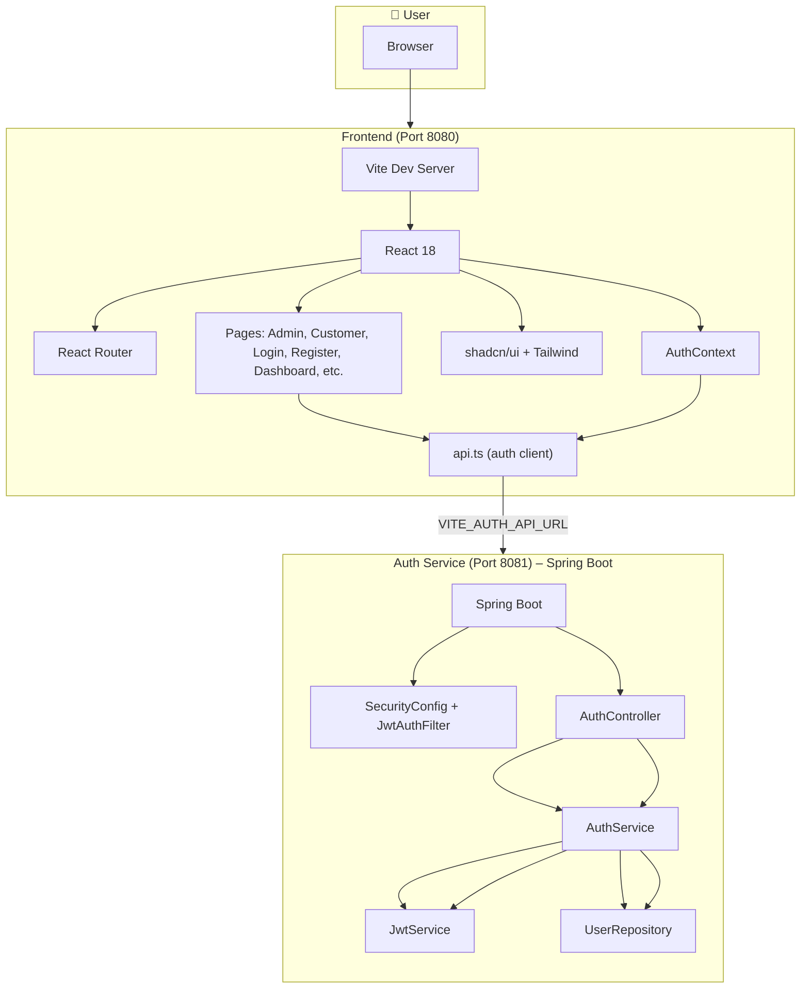
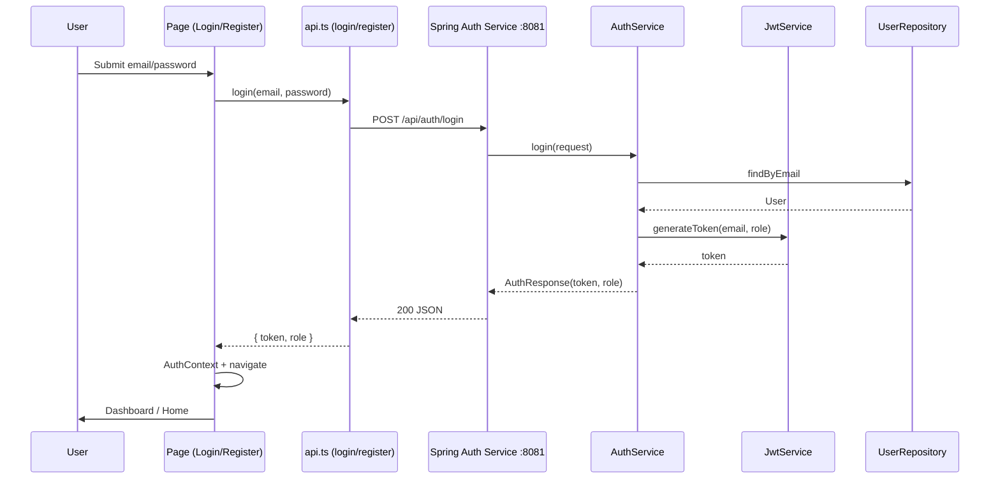
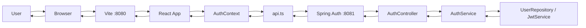
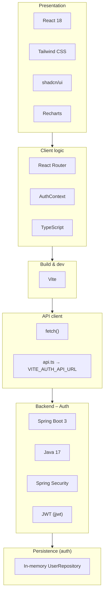
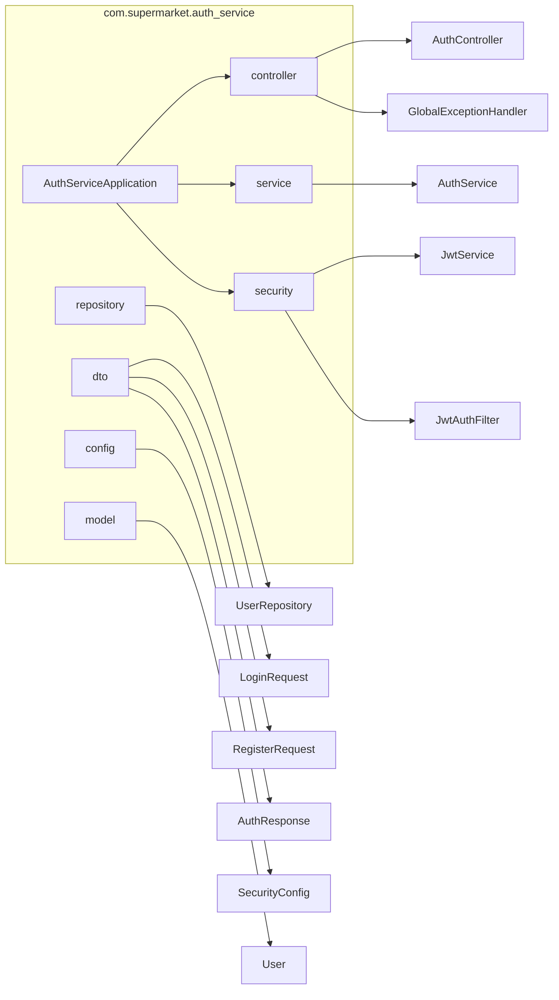
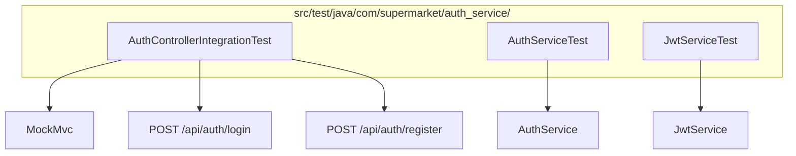

# Smart Trolley – Tech Stack Flow (Updated)

## Main architecture

## Request flow: Login / Register

## Simplified end-to-end flow

## Stack by layer

## Auth service package structure

## Test flow (auth-service)

---

*View in any Mermaid-compatible viewer (GitHub, VS Code with Mermaid extension, or [mermaid.live](https://mermaid.live)).*
